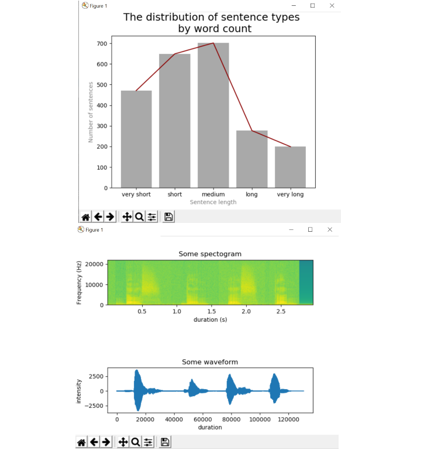

## PythonELTIT 
:octocat:

 A repository for homeworks, in-class tasks and personal projects concerning 
  English Linguistics: Theories, Interfaces, Technology 

#### Python from scratch:

This folder contains both homeworks and in-class exercises.
  Folder 'Python from scratch' was closed on: <strong>11.03.2020</strong> (no more significant updates)  

Content:  

 - basics: print, input, conditional statements
 - loops: while, for
 - functions (def)
 - importing modules
 - opening and working on files (txt, wav, xlsx)
 - matplotlib.pyplot
 - recursion
 - regular expressions
 
#### Internet data:

Continuation of Python course and expanding Internet data knowledge.
 Folder 'Internet data' is still being expanded. 

Content:  

- HTML examples, basics of HTML
- Fetching data from websites as HTML
- Parsing the HTML
- working with datetime
- writing a WebCrawler

#### Figures from the 'Python from scratch' folder:

